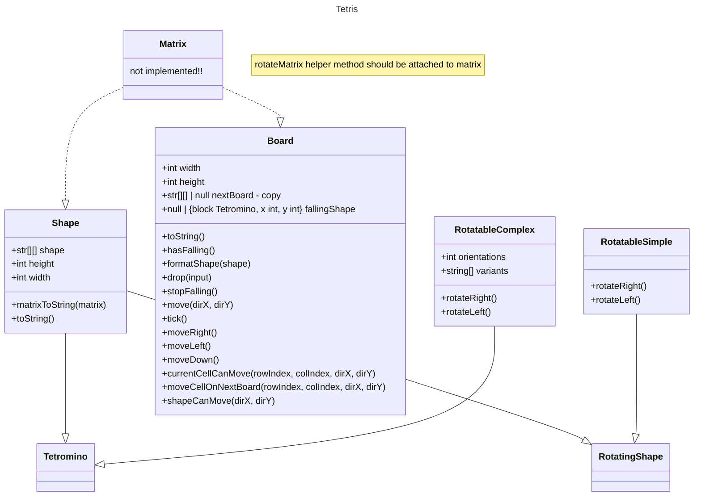

```mermaid
---
title: Tetris
---

 
classDiagram
    note "rotateMatrix helper method should be attached to matrix"
    Matrix ..|> Shape
    Matrix ..|> Board
    Matrix: not implemented!!
    Shape --|> Tetromino
    RotatableComplex --|> Tetromino
    Shape --|> RotatingShape
    RotatableSimple --|> RotatingShape
    RotatableSimple: +rotateRight()
    RotatableSimple: +rotateLeft()
    RotatableComplex: +int orientations
    RotatableComplex: +string[] variants
    RotatableComplex: +rotateRight()
    RotatableComplex: +rotateLeft()
    Shape: +str[][] shape
    Shape: +int height
    Shape: +int width
    Shape: +matrixToString(matrix)
    Shape: +toString()
    Board: +int width
    Board: +int height
    Board: +str[][] | null nextBoard - copy
    Board: +null | {block Tetromino, x int, y int} fallingShape 
    Board: +toString()
    Board: +hasFalling()
    Board: +formatShape(shape)
    Board: +drop(input)
    Board: +stopFalling()
    Board: +move(dirX, dirY)
    Board: +tick()
    Board: +moveRight()
    Board: +moveLeft()
    Board: +moveDown()
    Board: +currentCellCanMove(rowIndex, colIndex, dirX, dirY)
    Board: +moveCellOnNextBoard(rowIndex, colIndex, dirX, dirY)
    Board: +shapeCanMove(dirX, dirY)


```