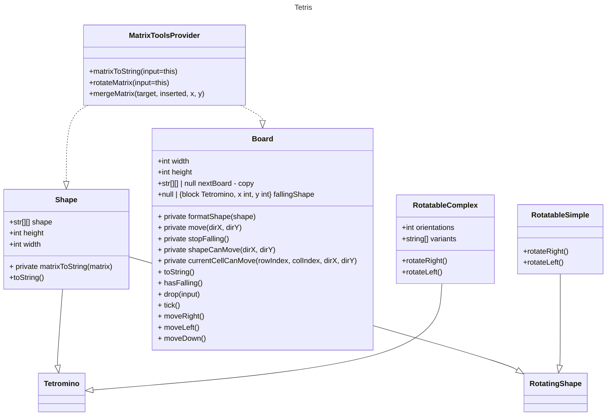

```mermaid
---
title: Tetris
---

 
classDiagram
    MatrixToolsProvider ..|> Shape
    MatrixToolsProvider ..|> Board
    MatrixToolsProvider: +matrixToString(input=this)
    MatrixToolsProvider: +rotateMatrix(input=this)
    MatrixToolsProvider: +mergeMatrix(target, inserted, x, y)
    Shape --|> Tetromino
    RotatableComplex --|> Tetromino
    Shape --|> RotatingShape
    RotatableSimple --|> RotatingShape
    RotatableSimple: +rotateRight()
    RotatableSimple: +rotateLeft()
    RotatableComplex: +int orientations
    RotatableComplex: +string[] variants
    RotatableComplex: +rotateRight()
    RotatableComplex: +rotateLeft()
    Shape: +str[][] shape
    Shape: +int height
    Shape: +int width
    Shape: + private matrixToString(matrix)
    Shape: +toString()
    Board: +int width
    Board: +int height
    Board: +str[][] | null nextBoard - copy
    Board: +null | {block Tetromino, x int, y int} fallingShape 
    Board: + private formatShape(shape)
    Board: + private move(dirX, dirY)
    Board: + private stopFalling()
    Board: + private shapeCanMove(dirX, dirY)
    Board: + private currentCellCanMove(rowIndex, colIndex, dirX, dirY)
    Board: + toString()
    Board: + hasFalling()
    Board: + drop(input)
    Board: + tick()
    Board: + moveRight()
    Board: + moveLeft()
    Board: + moveDown()
```